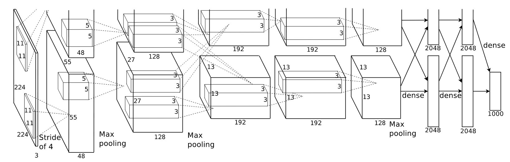

# Classical-Model
Replicate classical models' structure and test.

## 一、AlexNet 

### **1、模型结构**

### 2、**目录结构**

AlexNet.py：模型结构，无需修改。

utils.py：辅助函数定义，无需修改。

trainer.py：模型训练入口，无需修改。

config.py：定义各种参数，想要调参请修改这里的参数设置（包括模型和tensorboard存储地址）。

MNIST_loader.py：导入各种数据集，如果想要使用自己的数据请修改这里的读入程序。

**PS：本次测试将测试集作为验证集使用，如果想要增加测试集，就需在MNIST_loader.py中增加数据划分，并编写test文件。**

## 二、

